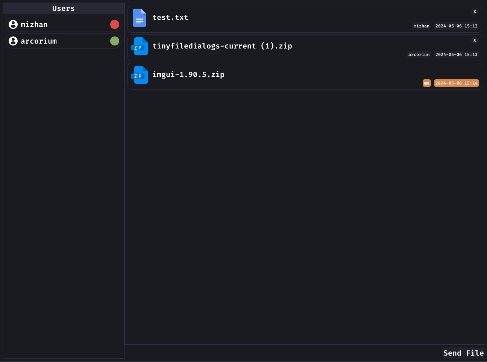
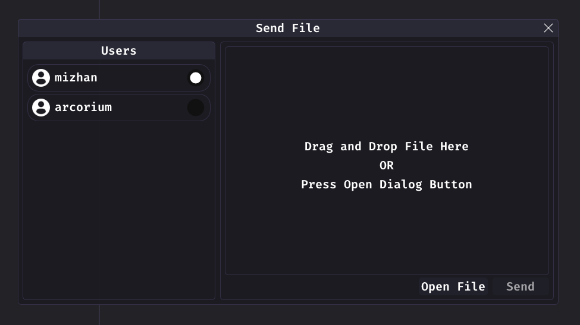

# NOURTON

Simple file sharing application over network. Transmitted data is encrypted using Dual Modulus RSA (DM-RSA)
and Camellia.

## Screenshot




## Prerequisite

- CMake (at least v3.15)
- vcpkg
- C++ compiler with c++23 support (Clang 18/MSVC 17.9)

## Dependencies

All dependencies are defined on `vcpkg.json` file and automatically installed when building the project. Dependencies
that aren't defined on vcpkg.json are located on `/thirdparty` folder, they are:

- [AES](https://github.com/SergeyBel/AES) [MIT]
- [glad](https://github.com/Dav1dde/glad) [MIT]
- [IconFontCppHeaders](https://github.com/juliettef/IconFontCppHeaders) [Zlib]
- [Dear ImGui](https://github.com/ocornut/imgui) [MIT]
- [primesieve](https://github.com/kimwalisch/primesieve) [BSD-2]
- [stb](https://github.com/nothings/stb) [Public]
- [tinyfiledialog](https://sourceforge.net/projects/tinyfiledialogs/) [Zlib]

## Build

if you doesn't have vcpkg installed consider to get the vcpkg first by:

```cmd
> git clone https://github.com/microsoft/vcpkg
> .\vcpkg\bootstrap-vcpkg.bat
```

or go to [vcpkg repository](https://github.com/microsoft/vcpkg) for more detailed explanation.

build project using cmake (change `VCPKG_ROOT` with vcpkg path installation):

```cmd
> cmake -B build -S . -DCMAKE_TOOLCHAIN_FILE={VCPKG_ROOT}\scripts\buildsystems\vcpkg.cmake -DCMAKE_BUILD_TYPE=Release
> cmake --build build
```

if you just cloned the vcpkg, then it will become like this:

```cmd
> cmake -B build -S . -DCMAKE_TOOLCHAIN_FILE=.\vcpkg\scripts\buildsystems\vcpkg.cmake -DCMAKE_BUILD_TYPE=Release
> cmake --build build
```

**NOTE:** If you want to use global vcpkg you can delete `vcpkg.json` file, so it will not trying to build library again

## Usage

Run the server with:

```cmd
> ./nourton-server [--ip xx.xx.xx.xx] [--port xxxx]
```

if the ip or port argument is not defined, it will use the default value. you can see the default value by:

```cmd
> ./nourton-server --help
```

Run the client:

```cmd
> ./nourton-client [--ip xx.xx.xx.xx] [--port xxxx] [--dir ./files]
```

if one of argument is not defined, it will use the default value like on the server. you can see the default value by:

```cmd
> ./nourton-client --help
```
